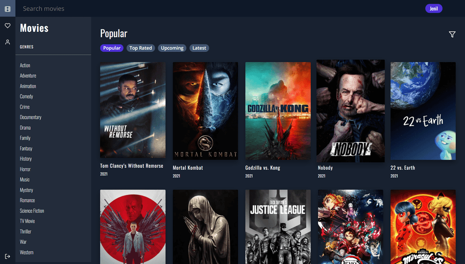

<!-- PROJECT SHIELDS -->
<!--
*** I'm using markdown "reference style" links for readability.
*** Reference links are enclosed in brackets [ ] instead of parentheses ( ).
*** See the bottom of this document for the declaration of the reference variables
*** for contributors-url, forks-url, etc. This is an optional, concise syntax you may use.
*** https://www.markdownguide.org/basic-syntax/#reference-style-links
-->
[](https://app.netlify.com/sites/entertainmentmovie/deploys)


<!-- PROJECT LOGO -->
<br />
<p align="center">
  <a href="https://entertainmentmovie.netlify.app/">
    
  </a>

  <h3 align="center">Entertainment Movie</h3>

  <p align="center">
    📽️ Amazing Movie Browsing React App 📽️
    <br />
    <br />
    <a href="https://entertainmentmovie.netlify.app/">View Demo</a>
  </p>
</p>


<!-- ABOUT THE PROJECT -->
# About The Project

  <a href="https://entertainmentmovie.netlify.app/">
    
  </a>

#### Amazing Movie Browsing app with beautiful UI built using MERN stack.

#### Current Features:
- View the most <strong>Popular</strong>, <strong>Top Rated</strong>, <strong>Upcoming</strong>, <strong>Latets</strong> movies
- Filter movies by different generes
- Search for movies
- View movie information (Description, Generes, Release Year, Cast, Gallery) and similar movies
- SignIn or SignUp to add movies to your watchlist

#### Feature Backlog:
- Add TV Shows
- Share your Movie or TV Show watchlist with other people

# Built With

This project was built using the MERN Stack (MongoDB, Express, React, NodeJs)

#### Backend
- Built a RESTful API using NodeJs and Express
  - API is used for SignIn/SignUp user and favourite movies which is stored on MongoDB.
  - Implemented JWT Authentication for SignIn/SignUp
  - API is hosted on Heroku
  - API Status: 
- Used the [The Movie DB](https://developers.themoviedb.org/3/getting-started) API to fetch all the movies

### Frontend
- Built using React and Bootstrap
- UI Design from Dribble

<!-- GETTING STARTED -->
## Getting Started
This will guide you through how to setup the project locally and get The Movie DB API key

### Prerequisites
- Clone this repo
- `npm install` to install all req'd dependencies
- `npm start` to start the local server (this project uses create-react-app)

### Installation

1. Get a free API from [The Movie DB](https://developers.themoviedb.org/3/getting-started) API to fetch all the movies

2. Replace this with your API Key in the <strong>.env</strong> file
   ```sh
   REACT_APP_MOVIE_DB_API_KEY={API_KEY}
   ```
  
### Project Dependencies
- [axios](https://www.npmjs.com/package/axios)
- [jwt-decode](https://www.npmjs.com/package/jwt-decode)
- [react-image-gallery](https://www.npmjs.com/package/react-image-gallery)
- [redux](https://www.npmjs.com/package/redux)
- [react-icons](https://www.npmjs.com/package/react-icons)
- [react-dom](https://www.npmjs.com/package/react-dom)


<!-- LICENSE -->
## License

Distributed under the MIT License. See `LICENSE` for more information.


<!-- CONTACT -->
## Contact

Jenil Vekaria - [GitHub](https://github.com/Jenil-Vekaria) / [LinkedIn](https://www.linkedin.com/in/jenil-vekaria)

<!-- ACKNOWLEDGEMENTS -->
## Acknowledgements
* [The Movie DB API](https://developers.themoviedb.org/3/getting-started)
* [Bootstrap](https://getbootstrap.com)
* [UI Design](https://dribbble.com/shots/2983800-Online-cinema/attachments/621936)
